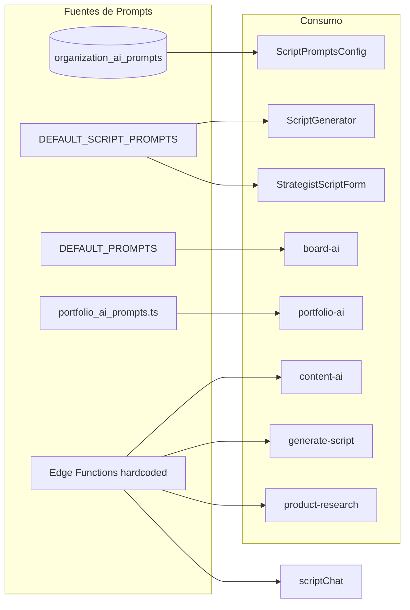

# Auditoría Completa — Estructura de Módulos de IA

**Fecha:** Febrero 2025  
**Fase 0:** Mapeo de archivos existentes

---

## 1. Inventario de Archivos Relacionados con IA

### 1.1 src/lib/

| Archivo | Propósito principal | Dependencias | Exports principales |
|---------|---------------------|--------------|---------------------|
| `src/lib/aiModuleKeys.ts` | Gobernanza: keys canónicos de módulos IA, definiciones, categorías | Ninguna | `BOARD_AI_MODULES`, `CONTENT_AI_MODULES`, `UP_AI_MODULES`, `TALENT_AI_MODULES`, `LIVE_AI_MODULES`, `GENERAL_AI_MODULES`, `AI_MODULE_DEFINITIONS`, `getModuleDefinition`, `getModulesByCategory`, `LEGACY_MODULE_MAPPINGS` |
| `src/lib/productResearchParser.ts` | Parsear JSON de investigación de producto y formatear para prompts | Ninguna | `parseProductResearch`, `formatResearchForPrompt` |
| `src/lib/prompts/portfolio_ai_prompts.ts` | Prompts estructurados para Portfolio AI (search, caption, bio, etc.) | Ninguna | `PORTFOLIO_AI_PROMPTS`, `PortfolioAIPromptKey` |
| `src/lib/edgeFunctions.ts` | Utilidades para invocar Edge Functions | Supabase | Funciones de invocación |

**Archivos que mencionan "ai/prompt/module" pero NO son core IA:**
- `src/lib/constants.ts`, `utils.ts`, `roles.ts` — referencias menores

---

### 1.2 src/hooks/

| Archivo | Propósito principal | Dependencias | Exports principales |
|---------|---------------------|--------------|---------------------|
| `src/hooks/useAIPrompts.ts` | Obtener/construir prompts por módulo desde DB o defaults | `supabase`, `aiModuleKeys` | `useAIPrompts`, `AIPromptConfig`, `DEFAULT_PROMPTS` |
| `src/hooks/useAIModules.ts` | CRUD de módulos IA por organización | `supabase`, `aiModuleKeys` | `useAIModules`, `AIModule`, `PREDEFINED_AI_MODULES` |
| `src/hooks/useScriptPrompts.ts` | Prompts de guiones (creador, editor, strategist, etc.) | `supabase` | `useScriptPrompts`, `DEFAULT_SCRIPT_PROMPTS`, `ScriptPromptsConfig` |
| `src/hooks/useBoardAI.ts` | Llamar board-ai para análisis de tarjetas/board | `supabase`, `useToast` | `useBoardAI`, interfaces de análisis |
| `src/hooks/useOrganizationAI.ts` | Config de proveedores IA, defaults, módulos org | `supabase`, `useAuth` | `useOrganizationAI`, `AI_PROVIDERS_CONFIG`, `AI_MODULES` |
| `src/hooks/usePortfolioAI.ts` | Ejecutar acciones IA en portfolio (caption, bio, search, etc.) | `supabase`, `supabaseLovable`, `usePortfolioAIConfig`, `toast` | `usePortfolioAI` |
| `src/hooks/usePortfolioAIConfig.ts` | Configuración de IA en portfolio (features, model) | `supabase` | `usePortfolioAIConfig`, `PortfolioAIFeatures` |
| `src/hooks/useTalentAI.ts` | Llamar talent-ai para matching, quality, risk, etc. | `supabase`, `useOrgOwner`, `toast` | `useTalentAI`, interfaces de resultado |
| `src/hooks/useAIChat.ts` | Chat con IA (contexto general) | — | `useAIChat` |
| `src/hooks/useInterestExtractor.ts` | Extraer intereses con IA (interest-extractor) | — | `useInterestExtractor` |
| `src/hooks/useRecommendations.ts` | Recomendaciones de feed (feed-recommendations) | — | `useRecommendations` |

---

### 1.3 src/components/settings/ai/

| Archivo | Propósito principal | Dependencias | Exports principales |
|---------|---------------------|--------------|---------------------|
| `src/components/settings/ai/ScriptPromptsConfig.tsx` | UI para configurar prompts de guiones por rol | `supabase`, `DEFAULT_SCRIPT_PROMPTS` | `ScriptPromptsConfig` |
| `src/components/settings/ai/AIUsageDashboard.tsx` | Dashboard de uso de IA (logs, consumo) | `supabase` | `AIUsageDashboard` |

---

### 1.4 src/components/ con IA en nombre o función

| Archivo | Propósito principal | Dependencias | Exports principales |
|---------|---------------------|--------------|---------------------|
| `src/components/ai/AIProviderSelector.tsx` | Selector de proveedor/modelo IA | `useOrganizationAI`, `AI_PROVIDERS_CONFIG` | `AIProviderSelector` |
| `src/components/ai/AICopilotBubble.tsx` | Burbuja de notificaciones del copiloto IA | UI components | `AICopilotBubble`, `AINotification` |
| `src/components/ai/AIButton.tsx` | Botón con estado disabled si módulo inactivo | UI | `AIButton` |
| `src/components/board/BoardAIPanel.tsx` | Panel lateral de análisis IA del tablero | `useBoardAI`, `useAICopilot` | `BoardAIPanel` |
| `src/components/content/ContentAIAnalysis.tsx` | Análisis de contenido con IA | content-ai | `ContentAIAnalysis` |
| `src/components/content/AIThumbnailGenerator.tsx` | Generador de thumbnails con IA | build-image-prompt, generate-thumbnail | `AIThumbnailGenerator` |
| `src/components/content/ContentDetailDialog/scripts/ScriptAIChat.tsx` | Chat IA contextual sobre guión | script-chat | `ScriptAIChat` |
| `src/components/content/ScriptGenerator.tsx` | Generador de guiones (Bloque Creador) | content-ai, generate-script | `ScriptGenerator` |
| `src/components/content/StrategistScriptForm.tsx` | Formulario estratega para guiones | content-ai, StrategistScriptForm | `StrategistScriptForm` |
| `src/components/marketing/ContentValidationDialog.tsx` | Diálogo con ContentAIAnalysis | ContentAIAnalysis | — |
| `src/components/portfolio/AICaptionHelper.tsx` | Asistente de captions | usePortfolioAI | `AICaptionHelper` |
| `src/components/portfolio/AIBioHelper.tsx` | Asistente de bio | usePortfolioAI | `AIBioHelper` |
| `src/components/points/UPAIPanel.tsx` | Panel IA del sistema UP | up-ai-copilot | `UPAIPanel` |
| `src/components/settings/AIModulesManager.tsx` | Gestión de módulos IA por org | `useAIModules`, `aiModuleKeys` | `AIModulesManager` |
| `src/components/settings/AIModuleConfigDrawer.tsx` | Drawer de config de módulo | — | `AIModuleConfigDrawer` |
| `src/components/settings/AIAssistantSettings.tsx` | Config del asistente IA | — | `AIAssistantSettings` |
| `src/components/settings/OrganizationAISettings.tsx` | Config IA de la organización | `AIModulesManager`, etc. | — |
| `src/components/settings/PortfolioAISettings.tsx` | Config IA de portfolio | `usePortfolioAIConfig` | `PortfolioAISettings` |
| `src/components/team/TalentAITab.tsx` | Tab de IA en detalle de talento | useTalentAI | `TalentAITab` |
| `src/components/chat/AIChatPanel.tsx` | Panel de chat con IA | — | `AIChatPanel` |
| `src/components/chat/AIAssistantButton.tsx` | Botón del asistente IA | — | `AIAssistantButton` |
| `src/components/settings/tracking/TrackingAISettings.tsx` | Config IA de tracking | — | — |

---

### 1.5 supabase/functions/ — Edge Functions de IA

| Función | Propósito principal | Prompts | Invocada por |
|---------|---------------------|---------|--------------|
| `ai-assistant` | Asistente IA general | — | ai-assistant |
| `analyze-video-content` | Análisis de contenido de video | hardcodeados | — |
| `board-ai` | Análisis tarjetas, board, bottlenecks, automatización | system/user en código | useBoardAI |
| `build-image-prompt` | Construir prompt para generación de imágenes | PROMPT_BUILDER_INSTRUCTION | AIThumbnailGenerator |
| `content-ai` | Generar/analizar/mejorar guiones, chat, research | MASTER_SYSTEM_PROMPT, SYSTEM_PROMPTS | ScriptGenerator, StrategistScriptForm |
| `evaluate-profile-tokens` | Evaluar tokens de perfil | hardcodeado | — |
| `feed-recommendations` | Recomendaciones de feed (algoritmo) | No IA LLM | useRecommendations |
| `generate-achievement-icon` | Generar icono de logro | — | — |
| `generate-script` | Generar guión UGC simple | systemPrompt + SPHERE_PHASE_DETAILS | ScriptGenerator |
| `generate-thumbnail` | Generar imagen thumbnail | prompt desde cliente | AIThumbnailGenerator |
| `interest-extractor` | Extraer intereses | — | useInterestExtractor |
| `multi-ai` | Múltiples tareas IA | — | — |
| `portfolio-ai` | Search, caption, bio, moderation, blocks | switch por action | usePortfolioAI |
| `product-research` | Investigación de mercado Método ESFERA | RESEARCH_PROMPT, DISTRIBUTION_PROMPT | ProductBriefWizard |
| `script-chat` | Chat sobre guión existente | systemPrompt | ScriptAIChat |
| `streaming-ai-generate` | Títulos/descripciones eventos live | EVENT_TYPE_PROMPTS + prompts | useStreamingAI |
| `suggest-role` | Sugerir rol en registro | systemPrompt, userPrompt | OrgRegister |
| `talent-ai` | Matching, quality, risk, reputation, ambassador | systemPrompt por acción | useTalentAI |
| `up-ai-copilot` | Quality, events, antifraud, recommendations | systemPrompt por acción | UPAIPanel |

**Shared:**
- `_shared/ai-providers.ts` — Config proveedores Gemini/OpenAI/Anthropic, corsHeaders
- `_shared/kreoon-client.ts` — Cliente Supabase Kreoon

---

## 2. Diagrama de Dependencias (Mermaid)

```mermaid
flowchart TB
    subgraph lib["src/lib"]
        aiKeys[aiModuleKeys.ts]
        productParser[productResearchParser.ts]
        portfolioPrompts[prompts/portfolio_ai_prompts.ts]
    end

    subgraph hooks["src/hooks"]
        useAIPrompts[useAIPrompts.ts]
        useAIModules[useAIModules.ts]
        useScriptPrompts[useScriptPrompts.ts]
        useBoardAI[useBoardAI.ts]
        useOrgAI[useOrganizationAI.ts]
        usePortfolioAI[usePortfolioAI.ts]
        usePortfolioConfig[usePortfolioAIConfig.ts]
        useTalentAI[useTalentAI.ts]
        useStreamingAI[useStreamingAI]
    end

    subgraph settings["src/components/settings/ai"]
        ScriptPromptsConfig[ScriptPromptsConfig.tsx]
        AIUsageDashboard[AIUsageDashboard.tsx]
    end

    subgraph components["src/components"]
        AIModulesManager[AIModulesManager.tsx]
        AIModuleConfigDrawer[AIModuleConfigDrawer.tsx]
        AIProviderSelector[AIProviderSelector.tsx]
        BoardAIPanel[BoardAIPanel.tsx]
        ContentAIAnalysis[ContentAIAnalysis.tsx]
        AIThumbnailGenerator[AIThumbnailGenerator.tsx]
        ScriptAIChat[ScriptAIChat.tsx]
        ScriptGenerator[ScriptGenerator.tsx]
        StrategistScriptForm[StrategistScriptForm.tsx]
        AICaptionHelper[AICaptionHelper.tsx]
        AIBioHelper[AIBioHelper.tsx]
        UPAIPanel[UPAIPanel.tsx]
        TalentAITab[TalentAITab.tsx]
        ProductBriefWizard[ProductBriefWizard]
    end

    subgraph edge["supabase/functions"]
        boardAI[board-ai]
        contentAI[content-ai]
        generateScript[generate-script]
        scriptChat[script-chat]
        productResearch[product-research]
        portfolioAI[portfolio-ai]
        suggestRole[suggest-role]
        streamingAI[streaming-ai-generate]
        buildImagePrompt[build-image-prompt]
        generateThumbnail[generate-thumbnail]
        talentAI[talent-ai]
        upAICopilot[up-ai-copilot]
    end

    useAIPrompts --> aiKeys
    useAIModules --> aiKeys
    AIModulesManager --> useAIModules
    AIModulesManager --> aiKeys
    ScriptPromptsConfig --> useScriptPrompts
    AIProviderSelector --> useOrgAI

    useBoardAI --> boardAI
    BoardAIPanel --> useBoardAI

    ScriptGenerator --> contentAI
    ScriptGenerator --> generateScript
    StrategistScriptForm --> contentAI
    ScriptAIChat --> scriptChat
    ContentAIAnalysis --> contentAI

    ProductBriefWizard --> productResearch
    productParser --> ProductBriefWizard

    usePortfolioAI --> portfolioAI
    AICaptionHelper --> usePortfolioAI
    AIBioHelper --> usePortfolioAI
    usePortfolioAI --> usePortfolioConfig

    AIThumbnailGenerator --> buildImagePrompt
    AIThumbnailGenerator --> generateThumbnail

    useTalentAI --> talentAI
    TalentAITab --> useTalentAI

    UPAIPanel --> upAICopilot

    OrgRegister --> suggestRole

    useStreamingAI --> streamingAI
```

---

## 3. Diagrama de Flujo de Prompts

---

## 4. Código Duplicado

| Tipo | Ubicaciones | Descripción |
|------|-------------|-------------|
| **Config AI Providers** | `supabase/functions/_shared/ai-providers.ts`, `board-ai/index.ts`, `content-ai/index.ts`, `up-ai-copilot/index.ts` | Cada Edge Function redefine o copia lógica de proveedores (getHeaders, getBody, extractContent). `_shared/ai-providers.ts` existe pero no todas lo usan. |
| **makeAIRequest** | `suggest-role`, `streaming-ai-generate`, `portfolio-ai` | Función similar para llamar a Gemini/OpenAI con fallback. No compartida. |
| **getModuleAIConfig** | `generate-script`, `suggest-role`, `streaming-ai-generate`, `board-ai`, `content-ai`, `generate-thumbnail` | Lógica repetida para obtener provider/model/apiKey desde `organization_ai_modules`. |
| **MASTER_SYSTEM_PROMPT / Rol prompts** | `content-ai/index.ts`, `ScriptPromptsConfig.tsx` (DEFAULT_MASTER_PROMPT), `useScriptPrompts.ts` | Prompts de guiones duplicados entre content-ai y frontend. content-ai tiene su propia copia. |
| **Prompts Portfolio** | `portfolio_ai_prompts.ts` (frontend) vs `portfolio-ai/index.ts` | portfolio-ai usa prompts inline en switch; portfolio_ai_prompts.ts tiene definiciones estructuradas que NO se usan en la Edge Function. |

---

## 5. Prompts: Hardcodeados vs Configurables

| Módulo | Hardcodeado | Configurable |
|--------|-------------|--------------|
| **Scripts** | generate-script (base + ESFERA), script-chat | useScriptPrompts + organization_ai_prompts (scripts) |
| **Content-ai** | MASTER_SYSTEM_PROMPT, SYSTEM_PROMPTS, BLOCK_FORMAT, Perplexity | Parcial: content-ai lee organization_ai_prompts para scripts |
| **Product Research** | RESEARCH_PROMPT, DISTRIBUTION_PROMPT, phase prompts | No |
| **Board AI** | system/user prompts en analyzeCard, analyzeBoard, etc. | useAIPrompts (DEFAULT_PROMPTS) — pero board-ai NO los usa |
| **Portfolio AI** | switch/case en portfolio-ai/index.ts | portfolio_ai_prompts.ts existe pero no se invoca desde la función |
| **Suggest Role** | systemPrompt, userPrompt | No |
| **Streaming AI** | EVENT_TYPE_PROMPTS + user prompts | No |
| **Talent AI** | systemPrompt por acción | No |
| **UP AI Copilot** | systemPrompt por acción | No |
| **Build Image Prompt** | PROMPT_BUILDER_INSTRUCTION | No |
| **Evaluate Profile Tokens** | systemPrompt | No |

---

## 6. Inconsistencias en Nomenclatura

| Área | Inconsistencia |
|------|----------------|
| **Module keys** | `board_cards` vs `board.cards.ai` — LEGACY_MODULE_MAPPINGS mapea; board-ai usa `board_cards`, aiModuleKeys usa `board.cards.ai` |
| **Provider** | `lovable` vs `gemini` — Algunas funciones mapean lovable→gemini, otras no |
| **Tabla módulos** | `organization_ai_modules` vs RPC `register_ai_module` — module_key con guión bajo en algunas migraciones |
| **Prompts table** | `organization_ai_prompts` — module_key `scripts` en ScriptPromptsConfig; content-ai busca por module |
| **Edge Function naming** | `streaming_ai` vs `streaming-ai-generate` — Module key `streaming_ai`, función `streaming-ai-generate` |
| **Thumbnails** | Módulo `thumbnails` en generate-thumbnail; aiModuleKeys tiene `content.designer.ai` para lineamientos visuales (diferente) |

---

## 7. Resumen de Hallazgos

### Críticos
1. **Prompts duplicados:** content-ai y useScriptPrompts/ScriptPromptsConfig mantienen versiones separadas.
2. **portfolio_ai_prompts.ts no utilizado:** Definiciones en frontend no se envían a portfolio-ai.
3. **Config de proveedores repetida:** Múltiples Edge Functions replican lógica de AI_PROVIDERS y getModuleAIConfig.

### Medios
4. **useAIPrompts DEFAULT_PROMPTS:** Definidos pero board-ai (y posiblemente otros) no los consumen.
5. **Legacy mappings:** Convivencia de keys con guión bajo y punto; puede generar bugs en activación de módulos.

### Menores
6. **Nomenclatura mixta:** streaming_ai, thumbnails, content_detail como module_key sin estándar único.
7. **Falta de centralización:** No hay un único punto de verdad para prompts por módulo.

---

## 8. Recomendaciones para Fase 1

1. Centralizar prompts en un único origen (DB o archivo compartido) consumido por frontend y Edge Functions.
2. Usar `_shared/ai-providers.ts` en todas las Edge Functions de IA.
3. Crear `_shared/get-module-ai-config.ts` para eliminar duplicación de getModuleAIConfig.
4. Conectar `portfolio_ai_prompts.ts` con la Edge Function portfolio-ai (o migrar prompts a la función).
5. Estandarizar module_key (usar solo notación con punto: `board.cards.ai`).
6. Documentar qué módulos usan prompts desde DB vs hardcodeados.
