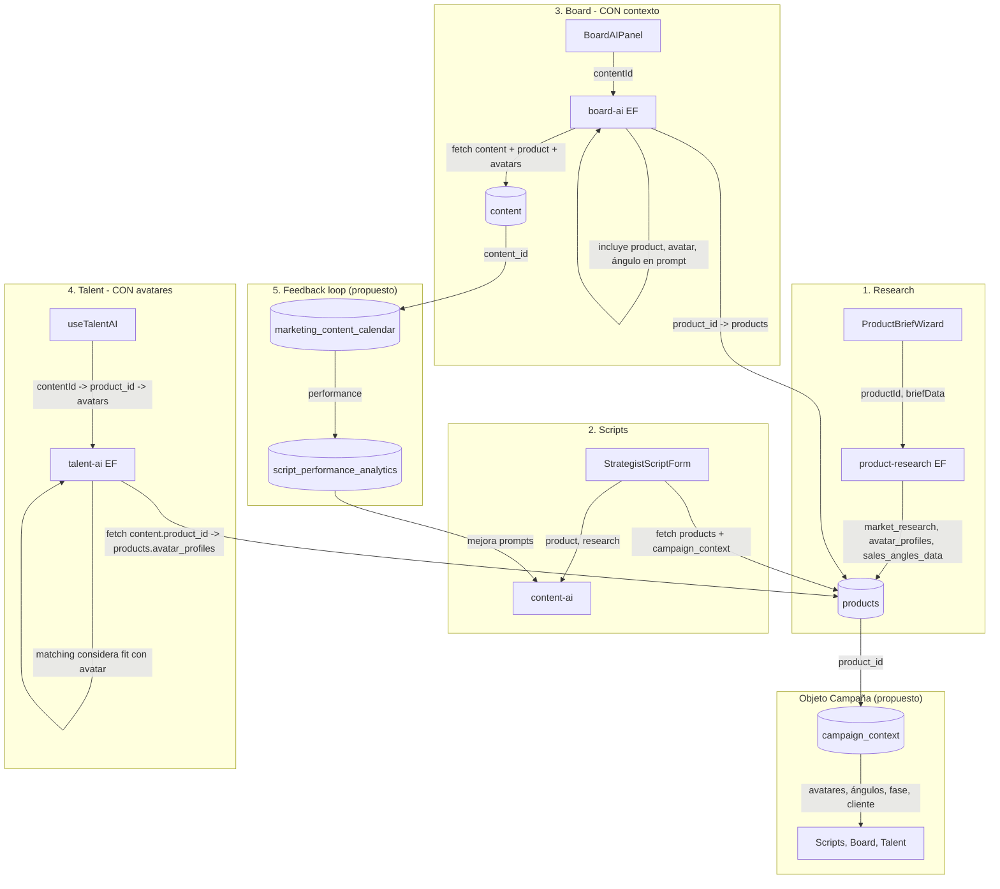

# Análisis de Flujo de Datos entre Módulos IA

**Fecha:** Febrero 2025

---

## 1. Flujos Actuales por Conexión

### 1.1 ProductBriefWizard → product-research → ¿A dónde van los datos?

| Paso | Componente | Acción | Destino |
|------|------------|--------|---------|
| 1 | ProductBriefWizard | `handleGenerateResearch()` | Invoca `product-research` con `productId`, `briefData` |
| 2 | product-research | Ejecuta fases A (A1/A2/A3) y B (B1/B2/B3) | — |
| 3 | product-research | `supabase.from('products').update(...)` | Tabla **products** |

**Datos que se persisten en `products`:**

| Campo | Origen | Contenido |
|-------|--------|-----------|
| `market_research` | Phase A1 | market_overview (marketSize, growthTrend, pains, desires, objections, etc.) |
| `ideal_avatar` | Phase A2 | JSON con jtbd (functional, emotional, social) |
| `competitor_analysis` | Phase A3 + B1 | competitors[], differentiation |
| `avatar_profiles` | Phase B1 | profiles: avatares estratégicos detallados |
| `content_strategy` | Phase B1 | esferaInsights, executiveSummary |
| `sales_angles_data` | Phase B2/B3 | angles[], puv, transformation, leadMagnets, videoCreatives |
| `brief_status` | — | 'in_progress' → 'completed' |
| `brief_data` | — | briefData original |
| `description` | Phase B1 | Descripción producto |

**¿Flujo automático?** Sí. Los datos van directamente a `products` vía update. No hay paso manual.

---

### 1.2 ScriptGenerator / StrategistScriptForm → generate-script / content-ai → ¿Usa datos del research?

| Paso | Componente | Acción |
|------|------------|--------|
| 1 | StrategistScriptForm | `fetchResearchProduct()` — `select("id, avatar_profiles, sales_angles_data, market_research, sales_angles, ideal_avatar")` desde `products` |
| 2 | StrategistScriptForm | Parsea `researchProduct` → `researchAvatars`, `researchAngles`, `researchPains`, `researchDesires`, `researchObjections` |
| 3 | StrategistScriptForm | `formatResearchForPrompt(parsedResearch)` (productResearchParser) para contexto IA |
| 4 | StrategistScriptForm | Llama `content-ai` con `product`, `script_params`, `full_research`, `parsed` |

**Datos del research que SÍ se usan:**
- `avatar_profiles` / `market_research.strategicAvatars` → avatares para contexto
- `sales_angles_data.angles` / `market_research.salesAngles` / `sales_angles` → ángulos precargados en formulario
- `market_research` (pains, desires, objections, jtbd) → contexto para prompts
- `ideal_avatar` → avatar objetivo
- `content_strategy` / `esferaInsights` → si está disponible

**¿Flujo automático?** Sí. StrategistScriptForm y ScriptGenerator hacen fetch explícito a `products` y pasan el research al generador de guiones. Los ángulos se precargan en el selector.

---

### 1.3 BoardAIPanel → board-ai → ¿Conoce el contexto de producto/campaña?

| Paso | Componente | Acción |
|------|------------|--------|
| 1 | BoardAIPanel | `useBoardAI(organizationId)` → `analyzeCard(contentId)` |
| 2 | useBoardAI | Invoca `board-ai` con `{ action: 'analyze_card', organizationId, contentId }` |
| 3 | board-ai | `supabase.from('content').select('*, client:clients(name), creator:profiles(...), editor:profiles(...)').eq('id', contentId)` |
| 4 | board-ai | Construye userPrompt con: title, client.name, status, daysInStatus, deadline, creator, editor, has script, has video, status history |

**Contexto que board-ai SÍ recibe:**
- Título del contenido
- Nombre del cliente
- Estado actual, días en estado, deadline
- Creador y editor asignados
- ¿Tiene guión? ¿Tiene video?
- Historial de estados

**Contexto que board-ai NO recibe:**
- Producto (content tiene `product_id` pero board-ai no hace join con `products`)
- Ángulo de venta, fase ESFERA
- Avatares, investigación de mercado
- Campaña de marketing
- Script o guidelines

**¿Flujo automático?** Parcial. board-ai obtiene datos de `content` automáticamente, pero no expande producto ni campaña. No hay integración con research.

---

### 1.4 TalentAI → ¿Usa avatares del research para matching?

| Paso | Componente | Acción |
|------|------------|--------|
| 1 | useTalentAI | `findBestMatch(role, { contentId?, contentType?, deadline?, priority? })` |
| 2 | talent-ai | Recibe: `organizationId`, `role`, `contentId?`, `contentType?`, `deadline?`, `priority?` |
| 3 | talent-ai | Obtiene talentos de `organization_member_roles` + `profiles` (quality_score_avg, reliability_score, velocity_score, ai_recommended_level, ai_risk_flag) |
| 4 | talent-ai | Calcula `active_tasks` por talento |
| 5 | talent-ai | System prompt: "Considera: carga de trabajo, score de calidad, confiabilidad, riesgo, nivel recomendado. Deadline: X, Prioridad: X, Tipo: X" |
| 6 | talent-ai | User prompt: JSON de `talentWithWorkload` |

**¿Se usa avatar o product?** No. talent-ai:
- No recibe avatar_profiles
- No hace fetch de `content` para obtener `product_id`
- No hace fetch de `products` para obtener avatares
- El matching se basa exclusivamente en: carga de trabajo, quality_score, reliability_score, velocity_score, ai_recommended_level, ai_risk_flag

**¿Flujo automático?** Solo para métricas de talento. No hay flujo desde research → matching.

---

## 2. Resumen por Pregunta

| Pregunta | Respuesta |
|----------|-----------|
| ¿Los datos fluyen automáticamente o hay que copiar/pegar manual? | Research→Products: automático. Products→Scripts: automático (fetch + contexto). Board: solo content, no producto. Talent: solo métricas, sin avatares. |
| ¿Qué información se pierde entre módulos? | Board: se pierde producto, avatar, ángulo, fase ESFERA, research. Talent: se pierden avatares (fit avatar-talent). Scripts→Performance: no hay feedback loop. |
| ¿Hay un objeto de "campaña" o "proyecto" que persista el contexto? | Parcial: `content` tiene `product_id`, `client_id`, `marketing_campaign_id`, `sales_angle`, `sphere_phase`. `products` tiene el research. No hay un objeto "campaign" único que agrupe producto + research + contenidos + métricas. |

---

## 3. Gaps Identificados

### Gap 1: Research genera avatares → ¿Se usan para matching de creadores?

**Estado:** No se usan.

- Research guarda `avatar_profiles.profiles` (avatares detallados: demografía, drivers, objeciones, etc.).
- Talent matching no recibe ni usa estos datos.
- Oportunidad: Pasar avatar ideal del content/product al talent-ai para que el matching considere "fit" entre perfil del creador y avatar objetivo (ej. "creador mujer 25-35, estilo cercano" vs avatar "María, 28, busca soluciones prácticas").

### Gap 2: Research genera ángulos → ¿Se precargan en formulario de guiones?

**Estado:** Sí se precargan.

- StrategistScriptForm y StandaloneScriptGenerator cargan `sales_angles_data.angles`, `market_research.salesAngles`, `sales_angles` y los muestran en el selector.
- ProductResearchSelector permite elegir research de un producto y rellenar ángulos.
- Este flujo funciona correctamente.

### Gap 3: Guiones generados → ¿Se asocian a métricas de performance?

**Estado:** Asociación indirecta, sin feedback loop.

- `content` tiene `product_id`, `marketing_campaign_id`.
- `marketing_content_calendar` tiene `content_id` y `performance` (reach, likes, comments, etc.).
- No hay:
  - Relación explícita script_version → content → performance
  - Pipeline que alimente performance de vuelta para mejorar prompts
  - Dashboard que compare variantes de guión (hook A vs B) vs métricas

---

## 4. Diagrama de Flujo Actual (Mermaid)

```mermaid
flowchart TB
    subgraph Research["1. Research"]
        PBW[ProductBriefWizard]
        PR[product-research EF]
        Products[(products)]
        PBW -->|productId, briefData| PR
        PR -->|market_research, avatar_profiles, sales_angles_data, etc.| Products
    end

    subgraph Scripts["2. Scripts"]
        SSF[StrategistScriptForm]
        SG[ScriptGenerator]
        ContentAI[content-ai / generate-script]
        SSF -->|fetch products| Products
        SG -->|fetch products| Products
        SSF -->|product, research, script_params| ContentAI
        SG -->|product, research| ContentAI
        ContentAI -->|script HTML| ContentDetailDialog
    end

    subgraph Board["3. Board"]
        BAP[BoardAIPanel]
        BoardAI[board-ai EF]
        Content[(content)]
        BAP -->|contentId, organizationId| BoardAI
        BoardAI -->|fetch content (client, creator, editor, status)| Content
        BoardAI -.->|NO fetch product| Products
    end

    subgraph Talent["4. Talent"]
        TAI[useTalentAI]
        TalentAI[talent-ai EF]
        Profiles[(profiles)]
        TAI -->|role, contentId?, deadline?| TalentAI
        TalentAI -->|fetch talent + workload| Profiles
        TalentAI -.->|NO fetch avatars| Products
    end

    subgraph ContentFlow["Content & Campaign"]
        Content
        MCC[(marketing_content_calendar)]
        Content -->|content_id| MCC
        MCC -->|performance JSONB| MCC
    end

    Products -.->|product_id (existe en content)| Content
    Content -.->|product_id NO usado por board-ai| BoardAI
```

---

## 5. Diagrama de Flujo Ideal Propuesto



---

## 6. Lista de Gaps a Cerrar

| # | Gap | Descripción | Impacto |
|---|-----|-------------|---------|
| 1 | Board sin contexto producto | board-ai no conoce producto, avatar, ángulo ni fase ESFERA | Análisis genérico; no puede sugerir "priorizar por fase de campaña" |
| 2 | Talent sin avatares | talent-ai no usa avatar_profiles para matching | Asignación por carga/calidad únicamente; no por fit con avatar |
| 3 | Sin feedback script→performance | No hay pipeline que relacione guión con métricas | No se puede optimizar prompts con datos reales |
| 4 | Sin objeto campaña unificado | Contexto disperso en products + content + marketing_campaigns | Difícil pasar "campaña completa" a módulos IA |
| 5 | content.product_id no aprovechado | Existe pero board-ai y talent-ai no lo usan | Desaprovechamiento de relaciones ya modeladas |

---

## 7. Priorización de Integraciones

### Alta prioridad

| Integración | Esfuerzo estimado | Valor |
|-------------|-------------------|-------|
| **board-ai: incluir producto** | Bajo. Hacer join `content` → `products` y añadir product name, sales_angle, sphere_phase al prompt. | Análisis más relevante por campaña. |
| **talent-ai: incluir avatar** | Medio. Recibir contentId, fetch content→product→avatar_profiles, añadir al prompt para "fit con avatar". | Mejor asignación creador–avatar. |

### Media prioridad

| Integración | Esfuerzo estimado | Valor |
|-------------|-------------------|-------|
| **Vista/objeto campaign_context** | Medio. Crear vista o función que devuelva product + research + contenidos asociados. | Base para futuras integraciones. |
| **Content→Product en board-ai** | Bajo. Ya existe product_id; falta join y uso en prompt. | Cierre del Gap 1. |

### Baja prioridad

| Integración | Esfuerzo estimado | Valor |
|-------------|-------------------|-------|
| **Script→Performance feedback** | Alto. Requiere modelo de versiones de script, ETL de performance, dashboard. | Mejora iterativa de prompts con datos. |
| **Campaign object unificado** | Alto. Nuevo modelo de datos y migraciones. | Arquitectura más limpia a largo plazo. |

---

## 8. Acciones Recomendadas Inmediatas

1. **board-ai**: Extender el `select` de content para incluir `product:products(name, sales_angle, sphere_phase)` y añadir esas variables al userPrompt.
2. **talent-ai**: Cuando `contentId` esté presente, hacer fetch de `content` con `product_id`, luego `products` con `avatar_profiles`, y añadir resumen del avatar al system/user prompt.
3. **Documentar**: Añadir a la documentación que `content.product_id` es la llave para conectar contenido con research y campaña.
